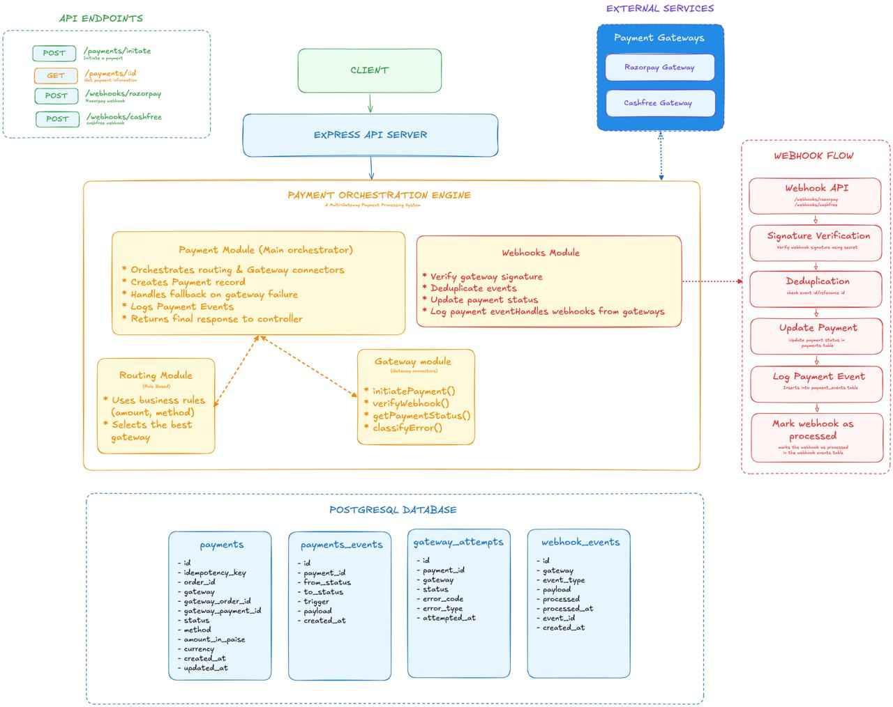
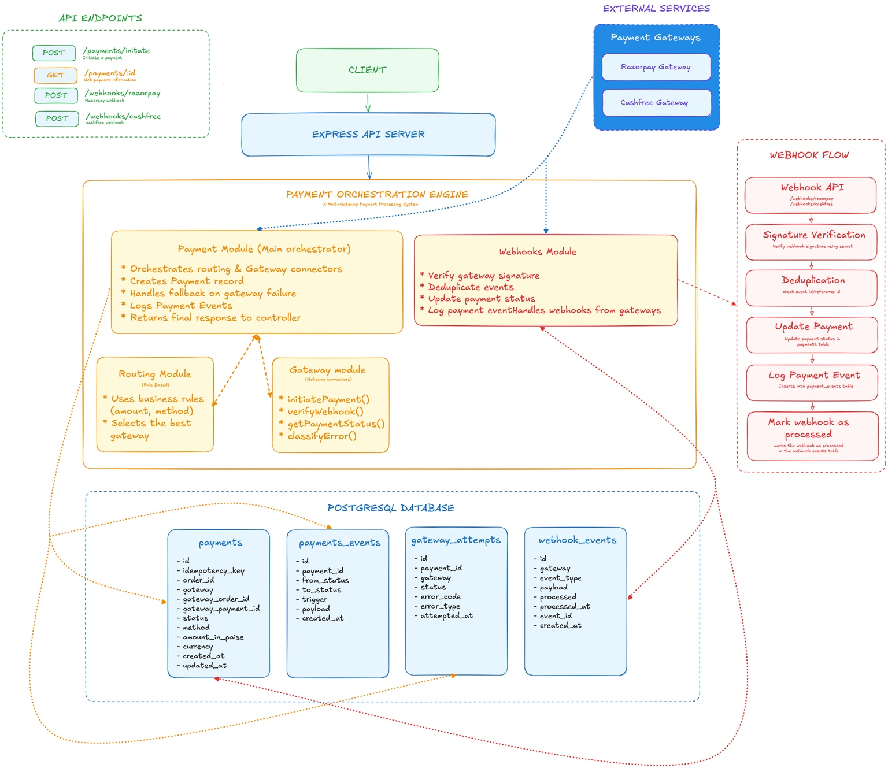

# Payment Orchestration Engine

A payment orchestration service that abstracts multiple payment gateways behind a single API. It routes transactions across Razorpay and Cashfree, supports automatic gateway fallback, verifies and deduplicates webhooks, and maintains a complete audit trail of payment events.

_Inspired by the architecture of modern payment orchestration platforms such as Juspay._

---

## Highlights

- Multi-gateway payment orchestration
- Automatic gateway routing
- Secure webhook verification
- Duplicate webhook protection
- Request idempotency
- PostgreSQL + Drizzle ORM
- Dockerized deployment

---

## Architecture



The Express API Server receives all payment requests and delegates them to the Payment Module. The Routing Module selects the appropriate payment gateway, while the Gateways Module communicates with external providers. Incoming webhook events are verified, deduplicated, and used to synchronize payment state in PostgreSQL.

<details>
<summary>Detailed Architecture (module-database connections)</summary>
</br>



</details>

---

## Request Flow

### Payment Initiation

1. The client sends a payment initiation request to the API.
2. The Payment Module validates the request and creates a new payment record.
3. The Routing Module selects the most appropriate payment gateway based on routing rules.
4. The Gateways Module creates the payment with the selected provider.
5. The gateway returns payment details (such as the payment link or order information).
6. The existing payment record is updated in PostgreSQL with the gateway's order ID and details.
7. The response is returned to the client.

### Webhook Processing

1. The payment gateway sends a webhook when the payment status changes.
2. The Webhooks Module verifies the webhook signature.
3. Duplicate webhook deliveries are detected and ignored.
4. The corresponding payment record is located.
5. The payment status is updated in PostgreSQL.
6. The processed event is recorded for auditing.
7. The updated payment status becomes available through the API.

---

## API Docs

Interactive API documentation is available through Scalar.

- **Live:** [Scalar API Documentation](https://payment-orchestration-engine-c8n3.onrender.com/docs)
- **Local:** http://localhost:8000/docs

---

## Core Features

### Payment Processing

- **Unified Payment API:** Initiate payments through a single API regardless of the underlying gateway.
- **Payment State Tracking:** Retrieve the latest payment status and gateway details for any payment.

### Gateway Integrations

- **Razorpay Integration:** Payment creation and secure webhook handling.
- **Cashfree Integration:** Payment creation and secure webhook handling.

### Webhooks

- **Idempotent Webhook Processing:** Duplicate webhook deliveries are detected and ignored.
- **Signature Verification:** Validates webhook authenticity using gateway secrets.

### Developer Experience

- Strongly typed codebase using TypeScript.
- Type-safe database access with Drizzle ORM.
- Multi-stage Docker builds for development and deployment.

### Monitoring & Logging

- Consistent error responses across all modules.
- Structured JSON logging with Pino for debugging, monitoring, and production observability.

### Security

- **API Key Authentication:** Secures internal endpoints from unauthorized access.
- **Idempotency:** Enforces unique request processing to prevent accidental double-charging.
- **Request Validation:** Strict runtime schema validation using Zod.

---

## Tech Stack

| Category         | Technology         |
| ---------------- | ------------------ |
| Runtime          | Node.js            |
| Framework        | Express.js         |
| Language         | TypeScript         |
| Database         | PostgreSQL         |
| ORM              | Drizzle ORM        |
| Validation       | Zod                |
| Documentation    | Scalar (OpenAPI)   |
| Testing          | Jest               |
| Containerization | Docker             |
| Payment Gateways | Razorpay, Cashfree |

---

## Folder Structure

```text
.
├── assets/
├── docs/
│   └── openapi.yml
├── src/
│   ├── app.ts
│   ├── server.ts
│   ├── clients/
│   ├── configs/
│   ├── constants/
│   ├── db/
│   ├── errors/
│   ├── middlewares/
│   │   ├── apiKeyAuth.ts
│   │   ├── errorHandler.ts
│   │   └── validation.ts
│   ├── modules/
│   │   ├── gateways/
│   │   ├── payments/
│   │   ├── routing/
│   │   └── webhooks/
│   ├── types/
│   └── utils/
├── tests/
├── Dockerfile
├── compose.dev.yml
├── compose.prod.yml
├── eslint.config.mjs
├── jest.config.ts
└── package.json
```

---

## Environment Variables

```env
PORT=8000
NODE_ENV=development

DATABASE_URL=

RAZORPAY_KEY_ID=
RAZORPAY_KEY_SECRET=
RAZORPAY_WEBHOOK_SECRET=

CASHFREE_CLIENT_ID=
CASHFREE_CLIENT_SECRET=

INTERNAL_API_KEY=
CLIENT_WEBHOOK_API=
```

---

## Run with Docker

Build the Docker image:

```bash
docker build -t payment-orchestration-engine .
```

Run the container:

```bash
docker run -p 8000:8000 --env-file .env payment-orchestration-engine
```

---

## Local Setup

1. **Clone the repository:**

   ```bash
   git clone https://github.com/sn0914r/payment-orchestration-engine.git
   ```

2. **Install dependencies:**

   ```bash
   npm install
   ```

3. **Configure environment variables:**
   Copy `.env.example` to `.env` and configure your local and gateway credentials.

4. **Initialize the database:**
   Generate and apply the database schema:

   ```bash
   npm run db:generate
   npm run db:migrate
   ```

5. **Start the server:**
   ```bash
   npm run dev
   ```

---

## API Endpoints

### Payments

| Method | Endpoint           | Description             |
| ------ | ------------------ | ----------------------- |
| POST   | /payments/initiate | Initiate a payment      |
| GET    | /payments/:id      | Retrieve payment status |

### Webhooks

| Method | Endpoint           | Description                     |
| ------ | ------------------ | ------------------------------- |
| POST   | /webhooks/razorpay | Process Razorpay webhook events |
| POST   | /webhooks/cashfree | Process Cashfree webhook events |

### Health & Docs

| Method | Endpoint | Description               |
| ------ | -------- | ------------------------- |
| GET    | /health  | Service health check      |
| GET    | /docs    | Interactive API reference |

---

## Security

- Internal API key authentication for service-to-service communication.
- Runtime request validation using Zod.
- Cryptographic verification of gateway webhooks.
- Idempotency keys to prevent duplicate payment creation.
- Centralized error handling with sanitized client responses.
