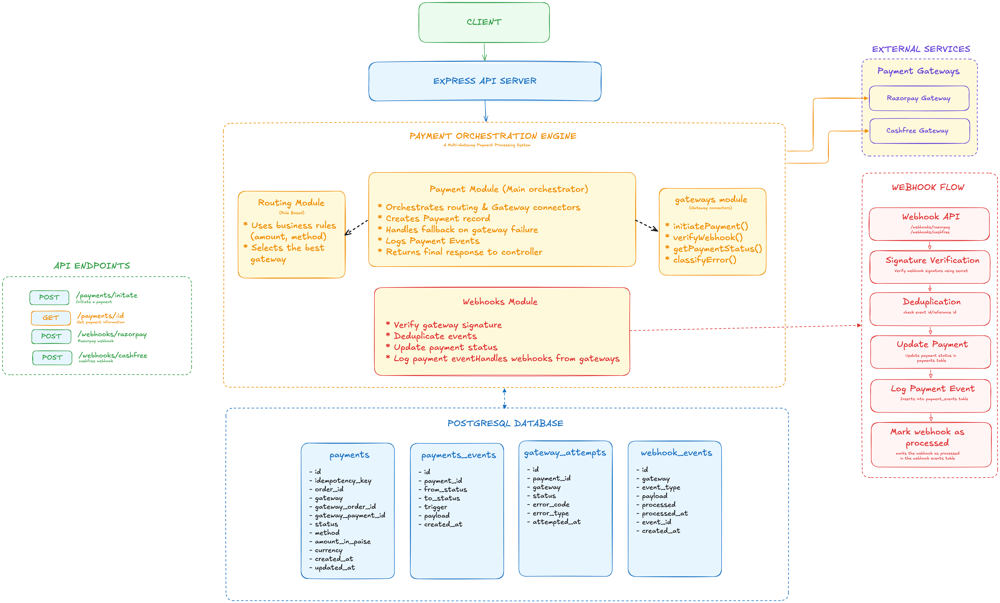

# Payment Orchestration Engine

> A payment orchestration engine that routes transactions across
> Razorpay and Cashfree, handles gateway failures with automatic
> fallback, deduplicates webhooks, and tracks every transaction
> with a full audit trail. (actively building)

## Architecture



## Tech Stack

- **Runtime:** Node.js, TypeScript
- **Framework:** Express
- **Database:** PostgreSQL (Drizzle ORM)
- **Logging:** Pino
- **Validation:** Zod

## API Endpoints

### POST `/payments/initiate`
Initiates a new payment routing through available gateways with automatic fallback logic.

### GET `/payments/:id`
Fetches the status and details of a specific payment.

### POST `/webhooks/razorpay`
Webhook handler for Razorpay payment events.

### POST `/webhooks/cashfree`
Webhook handler for Cashfree payment events.

## Folder Structure

```text
.
├── assets/
├── docs/
├── src/
│   ├── clients/
│   ├── configs/
│   ├── constants/
│   ├── db/
│   ├── errors/
│   ├── middlewares/
│   ├── modules/
│   │   ├── gateways/
│   │   ├── payments/
│   │   ├── routing/
│   │   └── webhooks/
│   ├── types/
│   ├── utils/
│   ├── app.ts
│   └── server.ts
├── .env.example
├── package.json
└── tsconfig.json
```

## Local Setup

```bash
# Clone the repository
git clone <repository_url>

# Install dependencies
npm install

# Setup environment variables
cp .env.example .env

# Run database migrations
npm run migrate

# Start the development server
npm run dev
```

## Environment Variables

```text
PORT=3000
NODE_ENV=development

DATABASE_URL=

RAZORPAY_KEY_ID=
RAZORPAY_KEY_SECRET=
RAZORPAY_WEBHOOK_SECRET=

CASHFREE_CLIENT_ID=
CASHFREE_CLIENT_SECRET=
```
